# 🏗️ Architecture — Document Approval System

> A comprehensive technical deep-dive into the architecture of the Document Approval System, covering both the **backend** (Node.js / Express) and the **client** (React / Vite).

---

## Table of Contents

- [1. High-Level Overview](#1-high-level-overview)
- [2. System Context Diagram](#2-system-context-diagram)
- [3. User Roles & Permissions Matrix](#3-user-roles--permissions-matrix)
- [4. Backend Architecture](#4-backend-architecture)
  - [4.1 Technology Stack](#41-technology-stack)
  - [4.2 Directory Structure](#42-directory-structure)
  - [4.3 Request Lifecycle](#43-request-lifecycle)
  - [4.4 Database Schema (MongoDB)](#44-database-schema-mongodb)
  - [4.5 Authentication & Session Management](#45-authentication--session-management)
  - [4.6 API Route Map](#46-api-route-map)
  - [4.7 Document Workflow Engine](#47-document-workflow-engine)
  - [4.8 Encryption & Key Exchange](#48-encryption--key-exchange)
  - [4.9 Notification Pipeline](#49-notification-pipeline)
- [5. Client Architecture](#5-client-architecture)
  - [5.1 Technology Stack](#51-technology-stack)
  - [5.2 Directory Structure](#52-directory-structure)
  - [5.3 Component Hierarchy](#53-component-hierarchy)
  - [5.4 State Management (Context API)](#54-state-management-context-api)
  - [5.5 Routing & Guards](#55-routing--guards)
  - [5.6 Service Layer](#56-service-layer)
  - [5.7 Client-Side Encryption Flow](#57-client-side-encryption-flow)
- [6. End-to-End Document Flow](#6-end-to-end-document-flow)
- [7. Security Architecture](#7-security-architecture)
- [8. Deployment Architecture](#8-deployment-architecture)

---

## 1. High-Level Overview

The **Document Approval System** digitises the traditional paper-based workflow between a **Personal Assistant (Assistant)** and a **Minister (Approver)**. Instead of physically carrying files for signatures, assistants upload encrypted documents which approvers can review, approve, reject, or request corrections on — all through a web interface with real-time push notifications.

```
┌───────────────────────────────────────────────────────────────────┐
│                    DOCUMENT APPROVAL SYSTEM                       │
│                                                                   │
│  ┌─────────────┐     ┌──────────────┐     ┌──────────────────┐   │
│  │  React SPA  │────▶│  Express API │────▶│    MongoDB       │   │
│  │  (Vite)     │◀────│  (REST)      │◀────│    (Mongoose)    │   │
│  └──────┬──────┘     └──────┬───────┘     └──────────────────┘   │
│         │                   │                                     │
│         │    ┌──────────────┴──────────────┐                     │
│         └───▶│  Firebase Cloud Messaging   │                     │
│              │  (Push Notifications)       │                     │
│              └─────────────────────────────┘                     │
└───────────────────────────────────────────────────────────────────┘
```

---

## 2. System Context Diagram

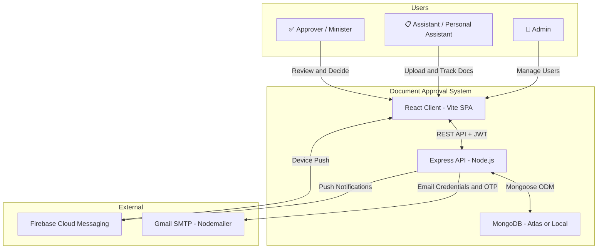

---

## 3. User Roles & Permissions Matrix

| Capability                  | 🔑 Admin | 📋 Assistant | ✅ Approver |
| :-------------------------- | :------: | :----------: | :---------: |
| Register new users          |    ✅     |      ❌       |      ❌      |
| Activate / Deactivate users |    ✅     |      ❌       |      ❌      |
| Update user profiles        |    ✅     |      ❌       |      ❌      |
| Send credentials via email  |    ✅     |      ❌       |      ❌      |
| Upload documents            |    ❌     |      ✅       |      ❌      |
| Download own documents      |    ❌     |      ✅       |      ❌      |
| Download any document       |    ✅     |      ❌       |      ✅      |
| View pending documents      |    ✅     |  ✅ (own)     |      ✅      |
| Approve / Reject documents  |    ❌     |      ❌       |      ✅      |
| Request corrections         |    ❌     |      ❌       |      ✅      |
| View document history       |    ✅     |  ✅ (own)     |      ✅      |
| Receive notifications       |    ❌     |      ✅       |      ✅      |
| Manage departments          |    ✅     |      ✅       |      ❌      |
| View all users              |    ✅     |      ❌       |      ✅      |

> **Design Constraint**: Only **one Approver** can exist in the system at any time — enforced at registration.

---

## 4. Backend Architecture

### 4.1 Technology Stack

| Layer            | Technology               | Purpose                              |
| :--------------- | :----------------------- | :----------------------------------- |
| Runtime          | Node.js                  | JavaScript server runtime            |
| Framework        | Express.js v4            | HTTP server and middleware pipeline    |
| Database         | MongoDB + Mongoose v8    | Document storage and ODM              |
| Authentication   | JWT (jsonwebtoken)       | Stateless auth tokens                |
| Password Hashing | Argon2id                 | Memory-hard password hashing         |
| Validation       | Joi                      | Request body/param validation        |
| File Upload      | Multer                   | Multipart form data handling         |
| Encryption       | node-forge + crypto      | RSA key exchange, AES enc keys       |
| Email            | Nodemailer (Gmail SMTP)  | Credential and OTP delivery            |
| Push             | Firebase Admin SDK       | FCM push notifications               |
| Unique IDs       | uuid v4                  | Session JTI generation               |

### 4.2 Directory Structure

```
backend/
├── server.js                 # Entry point — Express app bootstrap
├── config/
│   ├── appConfig.js          # Environment variable loader + validation
│   └── multerConfig.js       # File upload storage configuration
├── db/
│   └── connection.js         # MongoDB connection via Mongoose
├── models/
│   ├── user.model.js         # User schema (roles, encKey, deviceToken)
│   ├── file.model.js         # Document metadata + status tracking
│   ├── department.model.js   # Department categories
│   ├── notification.model.js # In-app notification records
│   ├── otp.model.js          # Time-limited OTP storage
│   └── session.model.js      # JWT session tracking (TTL: 7 days)
├── controllers/
│   ├── auth.controllers.js   # Register, Login, Logout, Session check
│   ├── file.controllers.js   # Upload, Download, Approve, Reject, Correction
│   ├── user.controllers.js   # Profile updates, Status toggle, Credentials email
│   ├── department.controllers.js  # CRUD for departments
│   ├── notification.controller.js # Fetch and mark-as-seen
│   └── otp.controllers.js    # OTP generation and verification
├── middlewares/
│   ├── auth.middlewares.js    # JWT verify, role authorization, input validators
│   ├── file.middlewares.js    # File attribute validation (dept, title)
│   ├── user.middlewares.js    # Profile update validators
│   └── otp.middlwares.js     # OTP-specific validation
├── routes/
│   ├── auth.routes.js         # /api/auth/*
│   ├── file.routes.js         # /api/file/*
│   ├── user.routes.js         # /api/user/*
│   ├── department.routes.js   # /api/department/*
│   └── notification.routes.js # /api/notification/*
├── utils/
│   ├── ApiResponse.js         # Standardized response wrapper
│   ├── createApiError.js      # Custom error class with status codes
│   ├── errorHandler.js        # Global Express error handler
│   ├── asyncHandler.js        # try/catch wrapper for async controllers
│   ├── enums.js               # Role and FileStatus constants
│   ├── hashPassword.js        # Argon2id hash and verify
│   ├── sendEmail.js           # Nodemailer transporter and MailOptions class
│   ├── otpUtils.js            # OTP generation helper
│   ├── validationSchemas.js   # Reusable Joi schemas
│   ├── NotificationService.js # FCM push message sender
│   └── firebase/
│       ├── firebaseAdmin..js  # Firebase Admin SDK initialization
│       └── firebase-service-account.json
└── uploads/                   # Encrypted file storage directory
```

### 4.3 Request Lifecycle

Every API request passes through a layered middleware pipeline:

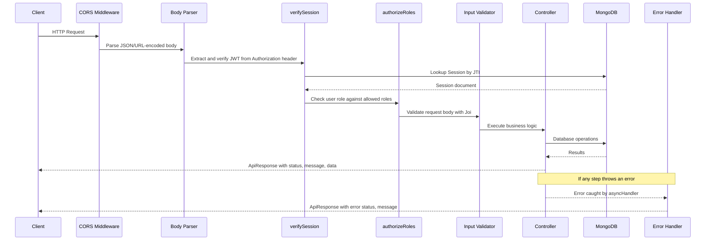

### 4.4 Database Schema (MongoDB)

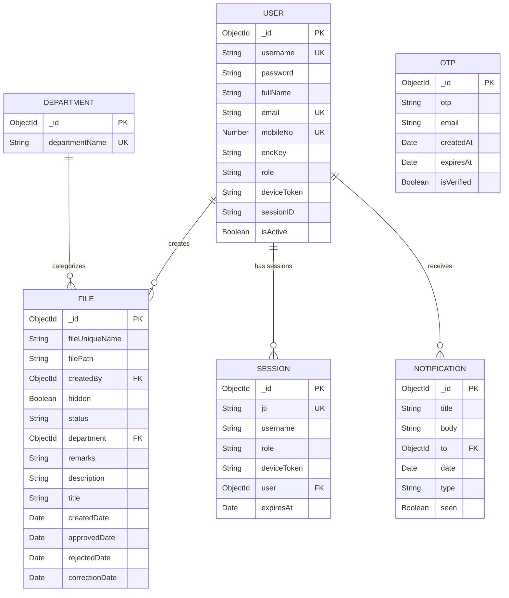

**Schema Details:**

| Model          | Key Fields                                     | Notes                                                    |
| :------------- | :--------------------------------------------- | :------------------------------------------------------- |
| **User**       | `username`, `encKey`, `role`, `isActive`        | `encKey` = random 32-byte hex AES key, generated at registration |
| **File**       | `fileUniqueName`, `status`, `createdBy`, `department` | Status: `pending`, `approved`, `rejected`, `correction` |
| **Session**    | `jti`, `user`, `deviceToken`, `expiresAt`      | TTL: 7 days, auto-deleted via MongoDB TTL index          |
| **Notification**| `to`, `type`, `seen`                          | Type mirrors `FileStatus` enum                           |
| **OTP**        | `otp` (hashed), `email`, `expiresAt`           | Expires 2 minutes after creation                         |

### 4.5 Authentication & Session Management

The system uses a **stateful JWT** pattern — tokens are signed with a secret but sessions are also persisted in MongoDB for revocation support.

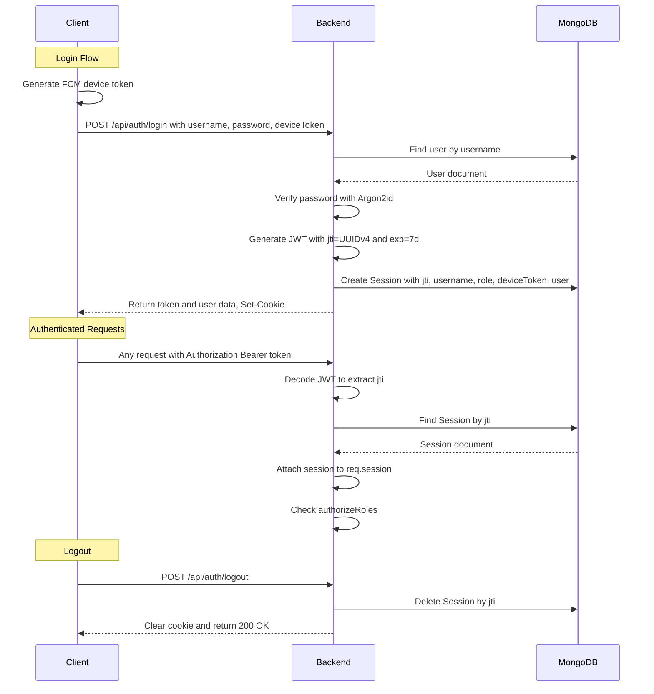

**Key Design Decisions:**

- **Multi-device sessions**: Each login creates a new `Session` document, allowing the same user to be logged in on multiple devices simultaneously
- **Session TTL**: Sessions auto-expire after 7 days via MongoDB TTL index
- **Force logout**: Admin can deactivate users, which terminates all their sessions
- **Device token per session**: FCM tokens are stored per-session, enabling push notifications to all active devices

### 4.6 API Route Map

#### Auth Routes — `/api/auth`

| Method | Endpoint       | Middleware                                   | Access    | Description              |
| :----- | :------------- | :------------------------------------------- | :-------- | :----------------------- |
| POST   | `/register`    | verifySession, authorizeRoles(ADMIN), validators, ensureUniqueUser | Admin     | Create new user account  |
| POST   | `/login`       | loginDetailsValidator, verifyAlreadyLoggedIn | Public    | Authenticate and get token |
| POST   | `/logout`      | verifySession                                | Auth      | Destroy current session  |
| GET    | `/get-session` | verifySession                                | Auth      | Validate token and get user info |

#### File Routes — `/api/file`

| Method | Endpoint              | Access            | Description                          |
| :----- | :-------------------- | :---------------- | :----------------------------------- |
| POST   | `/upload-pdf`         | Assistant          | Upload encrypted PDF                |
| GET    | `/download-pdf/:name` | All Auth          | Download encrypted file content     |
| GET    | `/get-documents`      | All Auth          | Query documents by status/filters   |
| POST   | `/approve`            | Approver           | Approve a pending document          |
| POST   | `/reject`             | Approver           | Reject a pending document           |
| POST   | `/correction`         | Approver           | Request corrections (requires remarks) |
| POST   | `/get-enc-key`        | All Auth          | RSA key exchange for AES key        |

#### User Routes — `/api/user`

| Method | Endpoint            | Access   | Description                        |
| :----- | :------------------ | :------- | :--------------------------------- |
| POST   | `/signout-all`      | Auth     | Terminate all sessions for user    |
| POST   | `/send-credentials` | Admin    | Email login credentials to a user  |
| POST   | `/update-profile`   | Admin    | Update user details (terminates sessions) |
| POST   | `/set-user-status`  | Admin    | Activate / deactivate users        |
| GET    | `/get-users`        | Admin, Approver | List all non-admin users    |

#### Department Routes — `/api/department`

| Method | Endpoint               | Access               | Description          |
| :----- | :--------------------- | :------------------- | :------------------- |
| GET    | `/get-all-departments` | All Auth             | List all departments |
| POST   | `/add-department`      | Admin, Assistant     | Create department    |

#### Notification Routes — `/api/notification`

| Method | Endpoint            | Access              | Description                  |
| :----- | :------------------ | :------------------ | :--------------------------- |
| GET    | `/get-notifications`| Assistant, Approver | Fetch unseen notifications   |
| POST   | `/mark-seen`        | Assistant, Approver | Mark all notifications seen  |

### 4.7 Document Workflow Engine

The core business logic revolves around the document status state machine:

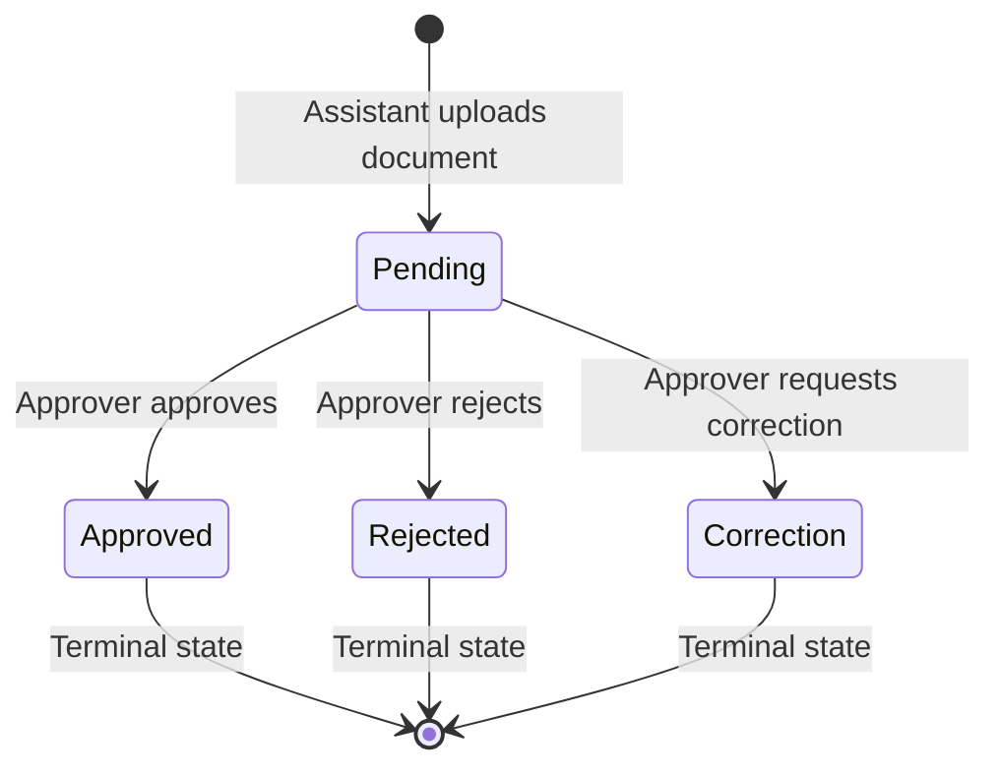

**Status Transition Rules:**
1. Only documents with `status: "pending"` can be transitioned
2. `Approved`, `Rejected`, and `Correction` are **terminal states** — once a document reaches these, its status cannot change
3. The `correction` status requires mandatory `remarks` explaining what needs to change
4. Each status transition records a timestamp (`approvedDate`, `rejectedDate`, `correctionDate`)
5. Notifications are created and pushed to the document creator on every status change
6. For re-submission after correction, the assistant must upload a new document

### 4.8 Encryption & Key Exchange

Documents are **encrypted client-side before upload** using AES, with per-user encryption keys exchanged securely via RSA.

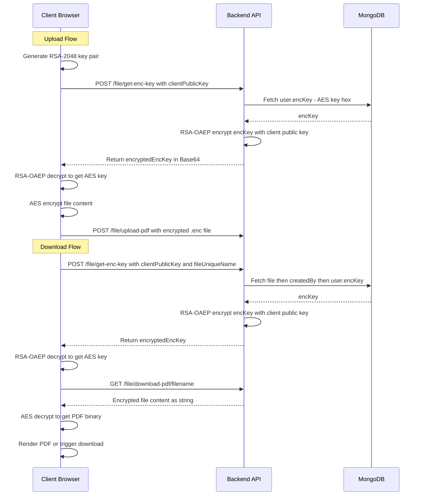

**Encryption Design:**

| Aspect                  | Detail                                                                 |
| :---------------------- | :--------------------------------------------------------------------- |
| **Per-user AES key**    | Generated at registration via `crypto.randomBytes(32).toString('hex')` |
| **Key storage**         | Stored in `User.encKey` in MongoDB (never leaves the server in plaintext) |
| **Key exchange**        | RSA-2048 OAEP with SHA-256 — client sends public key, server returns encrypted AES key |
| **File encryption**     | CryptoJS AES (client-side) — files stored as `.enc` text blobs        |
| **Key caching**         | Client caches decrypted AES keys in memory via `useRef` to avoid repeated exchanges |
| **Approver access**     | Approver retrieves the uploader's AES key via `fileUniqueName` lookup to decrypt any document |

### 4.9 Notification Pipeline

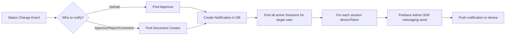

**Notification Types** (mapped to `FileStatus`):
- `pending` — New document uploaded (sent to Approver)
- `approved` — Document approved (sent to Assistant)
- `rejected` — Document rejected (sent to Assistant)
- `correction` — Correction requested (sent to Assistant)

---

## 5. Client Architecture

### 5.1 Technology Stack

| Layer          | Technology               | Purpose                                |
| :------------- | :----------------------- | :------------------------------------- |
| Framework      | React 19                 | UI component library                   |
| Build Tool     | Vite 8                   | Fast dev server and HMR                |
| Styling        | TailwindCSS 4            | Utility-first CSS framework            |
| Routing        | React Router DOM v7      | Client-side routing and guards         |
| HTTP Client    | Axios                    | API communication with interceptors    |
| Encryption     | CryptoJS + node-forge    | AES file encryption, RSA key exchange  |
| Push           | Firebase SDK (Web)       | FCM token generation and message listener |
| Notifications  | react-hot-toast          | Toast notifications UI                 |
| Icons          | Lucide React, React Icons| Icon libraries                         |

### 5.2 Directory Structure

```
client/
├── index.html                # SPA entry point
├── vite.config.js            # Vite configuration
├── public/                   # Static assets
├── utils/
│   ├── cryptoSecurity.js     # CryptoService singleton (legacy)
│   ├── enums.js              # Role and FileStatus constants (shared)
│   ├── firebaseUtils.js      # FCM init, token request, message listener
│   └── statusColors.js       # Document status to color mapping
├── src/
│   ├── main.jsx              # React DOM render entry
│   ├── App.jsx               # Root component — providers and routing
│   ├── index.css             # Global styles (TailwindCSS imports)
│   ├── App.css               # App-level styles
│   ├── contexts/
│   │   ├── AuthContext.jsx   # Auth state, login check, logout
│   │   ├── EncryptionContext.jsx  # RSA key pair, AES key exchange, caching
│   │   └── NotificationContext.jsx # Notification fetch, unread count, FCM token
│   ├── guards/
│   │   └── AuthGuard.jsx     # AuthGuard, RoleGuard, GuestGuard components
│   ├── hooks/
│   │   └── useFileHandlers.js # Upload, download, preview with encryption
│   ├── services/
│   │   ├── api.js            # Axios instance with auth interceptors
│   │   ├── authService.js    # Login, logout, register, getSession
│   │   ├── fileService.js    # Document CRUD operations
│   │   ├── userService.js    # User management API calls
│   │   ├── departmentService.js # Department API calls
│   │   └── notificationService.js # Notification API calls
│   ├── components/
│   │   ├── MainLayout.jsx    # Layout wrapper with Navbar + Outlet
│   │   ├── Navbar.jsx        # Navigation bar with role-based links
│   │   ├── DocumentsDashboard.jsx # Reusable document listing component
│   │   └── LoadingScreen.jsx # Full-screen loading spinner
│   └── pages/
│       ├── Login.jsx         # Login form with FCM token gate
│       ├── DashboardRedirect.jsx # Role-based dashboard redirect
│       ├── AssistantDashboard.jsx # Upload + pending documents view
│       ├── ApproverDashboard.jsx  # Review, approve, reject, correct
│       ├── AdminDashboard.jsx     # System overview dashboard
│       ├── ManageUsers.jsx   # User registration and management (Admin)
│       ├── Notifications.jsx # Notification list view
│       ├── History.jsx       # Document history with filters
│       ├── Profile.jsx       # User profile view
│       ├── EditProfile.jsx   # Edit user profile (Admin)
│       └── ChangePassword.jsx # Password change form
```

### 5.3 Component Hierarchy

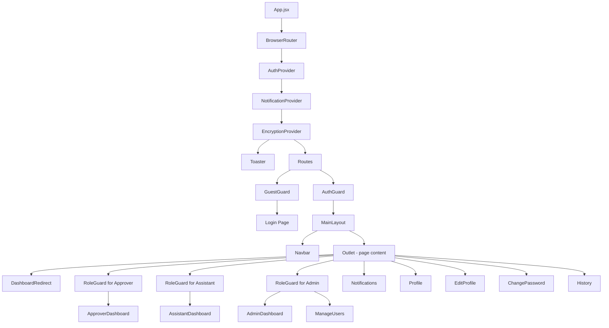

### 5.4 State Management (Context API)

The application uses React's Context API with three specialized providers stacked in order:

| Context               | State                          | Methods                              | Purpose                            |
| :-------------------- | :----------------------------- | :----------------------------------- | :--------------------------------- |
| **AuthContext**        | `loggedInUser`, `isAuthenticated`, `loading` | `checkAuthStatus()`, `logout()`, `setLoggedInUser()` | Authentication state management. On mount, checks localStorage for token and validates via `GET /auth/get-session` |
| **NotificationContext**| `notifications[]`, `unreadCount`, `fcmToken` | `fetchNotifications()`, `markAllAsRead()`, `setFcmToken()` | In-app notification state and FCM device token storage |
| **EncryptionContext**  | `rsaKeyPair`, `encKeyCache` (Ref) | `getEncKeyForAssistant()`, `getEncKeyForDoc(filename)` | RSA key pair generation and AES key exchange with caching |

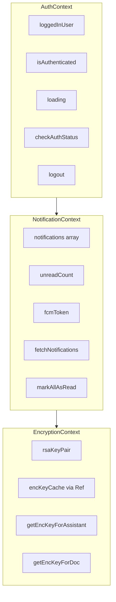

### 5.5 Routing & Guards

Three guard components protect routes based on authentication state and user roles:

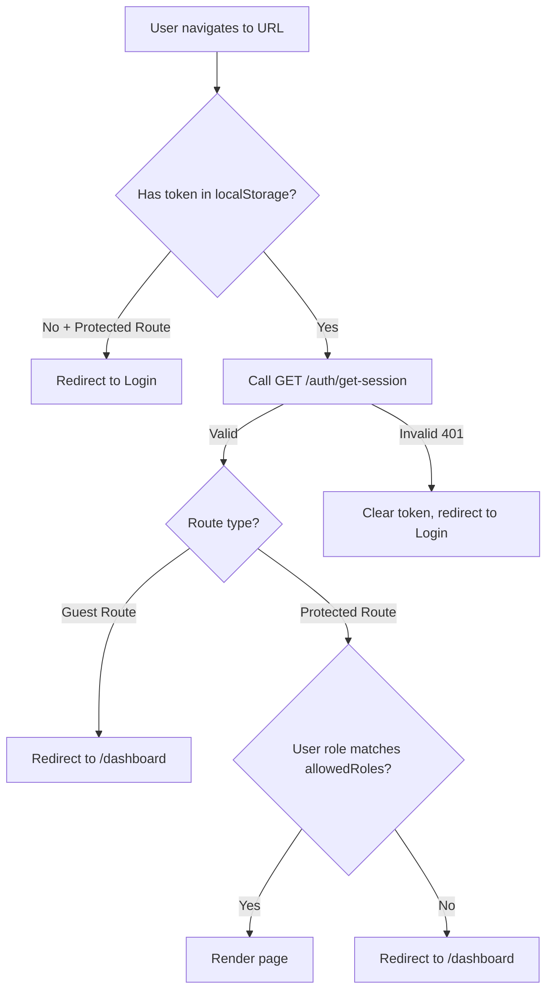

| Guard          | Wraps                | Behaviour                                                        |
| :------------- | :------------------- | :--------------------------------------------------------------- |
| `GuestGuard`   | Login page           | If authenticated, redirect to `/dashboard`                       |
| `AuthGuard`    | All protected routes | If not authenticated, redirect to `/` (Login)                    |
| `RoleGuard`    | Role-specific pages  | If role not in `allowedRoles`, redirect to `/dashboard`          |

### 5.6 Service Layer

The service layer abstracts API calls behind a clean interface, using a shared Axios instance:

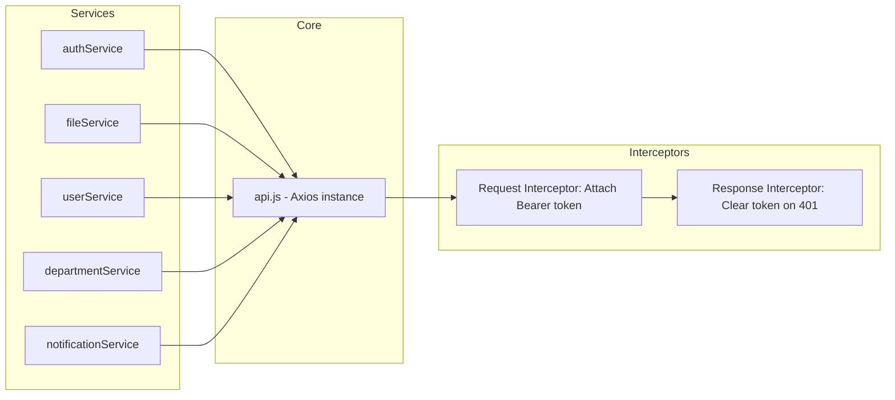

**Axios Interceptors:**
- **Request**: Automatically attaches `Authorization: Bearer <token>` from `localStorage`
- **Response**: On `401` with an auth header present, clears `localStorage` token (session expired/invalidated)

### 5.7 Client-Side Encryption Flow

```mermaid
flowchart TD
    subgraph Upload["Upload Flow"]
        U1["User selects PDF file"] --> U2["Read file as ArrayBuffer"]
        U2 --> U3["Fetch AES key via RSA exchange"]
        U3 --> U4["CryptoJS AES encrypt"]
        U4 --> U5["Wrap encrypted string in Blob"]
        U5 --> U6["Create FormData with .enc file"]
        U6 --> U7["POST /file/upload-pdf"]
    end

    subgraph Download["Download and Preview Flow"]
        D1["User clicks preview/download"] --> D2["Fetch AES key via RSA exchange"]
        D2 --> D3["GET /file/download-pdf/filename"]
        D3 --> D4["CryptoJS AES decrypt"]
        D4 --> D5["Convert WordArray to Uint8Array"]
        D5 --> D6["Create PDF Blob"]
        D6 --> D7{"Preview or Download?"}
        D7 -->|Preview| D8["Open Blob URL in new tab"]
        D7 -->|Download| D9["Trigger anchor download"]
    end
```

---

## 6. End-to-End Document Flow

This diagram traces a document from upload through approval, across both client and backend:

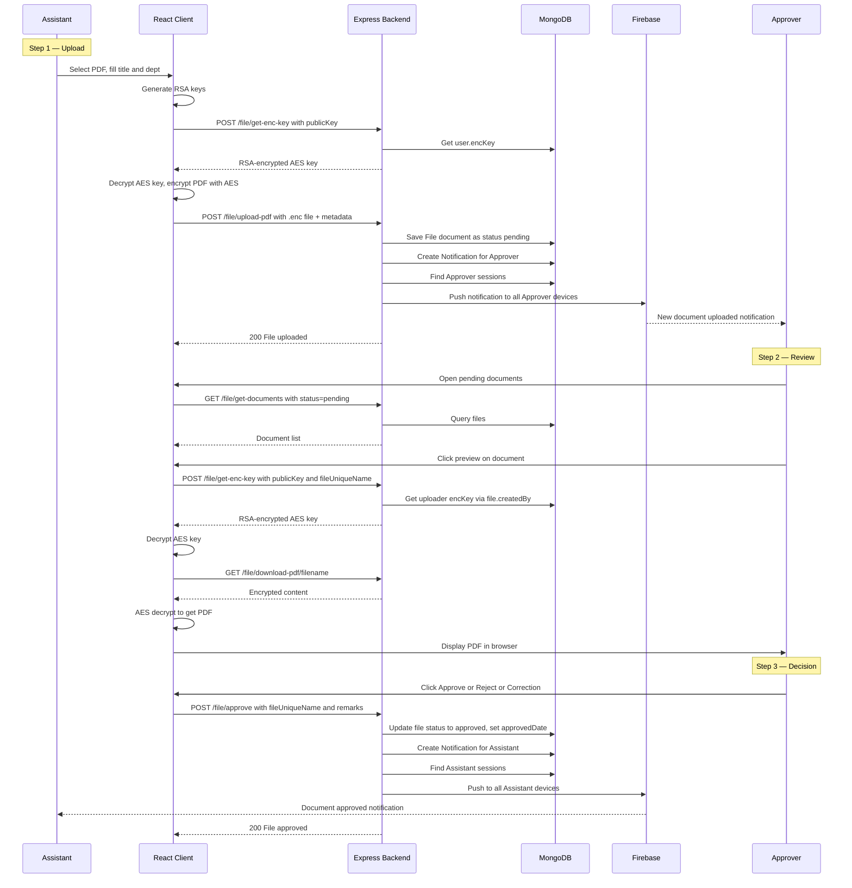

---

## 7. Security Architecture

| Layer              | Mechanism                           | Detail                                                    |
| :----------------- | :---------------------------------- | :-------------------------------------------------------- |
| **Password**       | Argon2id (memory: 64MB, time: 3)    | Memory-hard hashing resistant to GPU attacks              |
| **Authentication** | JWT + Server-side Sessions          | Tokens can be revoked by deleting session records          |
| **Authorization**  | Middleware role checks              | Applied per-route, not just at the UI level               |
| **Data at Rest**   | AES encryption (CryptoJS)          | Files stored encrypted on disk, keys stored in DB          |
| **Data in Transit**| RSA-OAEP key exchange              | AES keys encrypted with client's ephemeral RSA public key  |
| **Input Validation**| Joi schemas                        | All user inputs validated with strict patterns             |
| **File Access**    | Ownership checks                   | Assistants can only download their own documents           |
| **Session Mgmt**   | TTL index with 7-day expiry        | Sessions auto-deleted, force logout via session deletion   |
| **CORS**           | Whitelist-based origins            | Only specific localhost ports allowed                      |
| **Cookies**        | HttpOnly + SameSite: Strict        | Prevents XSS and CSRF attacks on session cookies          |
| **Error Handling** | Failed upload file cleanup         | Uploaded files deleted on controller errors               |
| **Single Approver**| Registration constraint            | Only one approver can exist, enforced at middleware level  |

---

## 8. Deployment Architecture

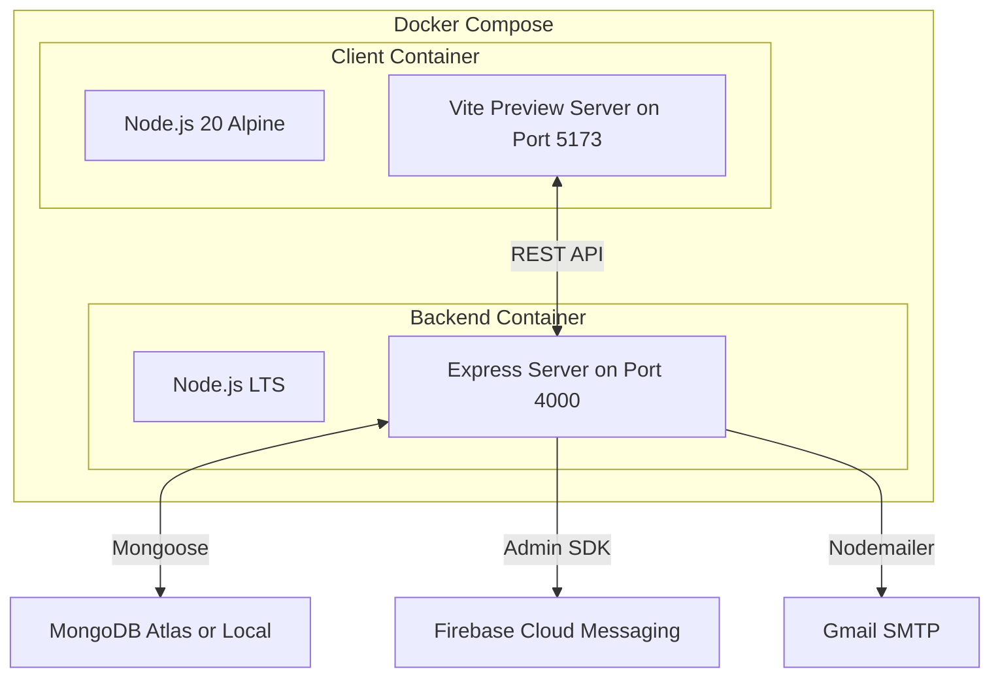

**Docker Configuration:**

| Service  | Base Image      | Port | Build                      |
| :------- | :-------------- | :--- | :------------------------- |
| backend  | `node:lts`      | 4000 | `npm install` then `node server.js` |
| client   | `node:20-alpine`| 5173 | `npm ci` then `npm run build` then `vite preview` |

**Environment Variables (Backend):**

| Variable          | Purpose                                     |
| :---------------- | :------------------------------------------ |
| `MONGODB_URI`     | MongoDB connection string                   |
| `JWT_SECRET`      | Secret for signing JWT tokens               |
| `AUTH_EMAIL`       | Gmail address for sending emails            |
| `AUTH_PASS`        | Gmail app password                          |
| `BASE_UPLOAD_DIR` | Absolute path for encrypted file storage    |
| `SESSION_SECRET`  | Session secret (legacy, still required)     |

**Environment Variables (Client):**

| Variable                            | Purpose                          |
| :---------------------------------- | :------------------------------- |
| `VITE_API_URL`                      | Backend API base URL             |
| `VITE_FIREBASE_API_KEY`             | Firebase project API key         |
| `VITE_FIREBASE_AUTH_DOMAIN`         | Firebase auth domain             |
| `VITE_FIREBASE_PROJECT_ID`          | Firebase project ID              |
| `VITE_FIREBASE_STORAGE_BUCKET`      | Firebase storage bucket          |
| `VITE_FIREBASE_MESSAGING_SENDER_ID` | FCM sender ID                    |
| `VITE_FIREBASE_APP_ID`             | Firebase app ID                  |
| `VITE_FIREBASE_MEASUREMENT_ID`     | Firebase analytics measurement   |
| `VITE_FIREBASE_VAPID_KEY`          | VAPID key for web push           |

---

> **Document Version**: 1.0 — Generated April 2026
