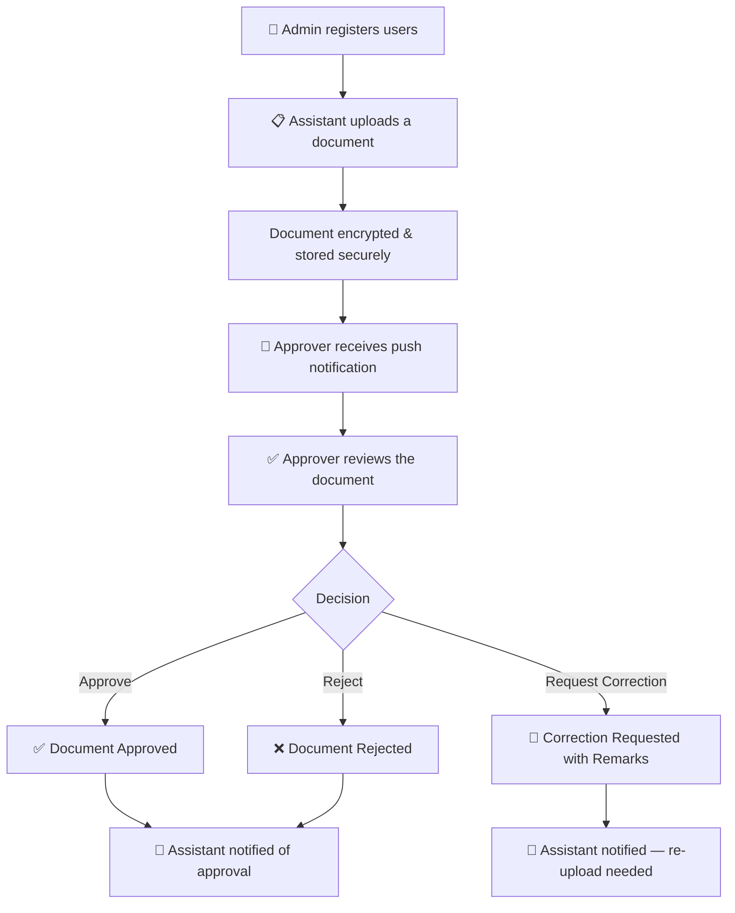
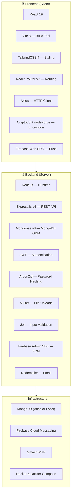

# 📄 Document Approval System — Project Overview

> **A secure, digital document approval platform that replaces the traditional paper-based file movement between Personal Assistants and Ministers with an encrypted, real-time, web-based workflow.**

---

## 📌 Table of Contents

- [1. Executive Summary](#1-executive-summary)
- [2. Problem Statement](#2-problem-statement)
- [3. Proposed Solution](#3-proposed-solution)
- [4. Key Features & Capabilities](#4-key-features--capabilities)
- [5. User Roles & Workflow](#5-user-roles--workflow)
- [6. How It Works — End-to-End Flow](#6-how-it-works--end-to-end-flow)
- [7. Security & Compliance Highlights](#7-security--compliance-highlights)
- [8. Business Benefits](#8-business-benefits)
- [9. Use Cases & Scenarios](#9-use-cases--scenarios)
- [10. Technology Stack Summary](#10-technology-stack-summary)
- [11. Deployment Model](#11-deployment-model)
- [12. Scalability & Future Roadmap](#12-scalability--future-roadmap)
- [13. Project Differentiators](#13-project-differentiators)
- [14. Conclusion](#14-conclusion)

---

## 1. Executive Summary

The **Document Approval System** is a full-stack web application designed to digitise and streamline the document approval workflow within government or organisational settings. It targets the interaction between a **Personal Assistant (Assistant)** — who prepares and submits documents — and a **Minister (Approver)** — who reviews and makes decisions on those documents.

The platform ensures that every document is **encrypted end-to-end** before it even leaves the user's browser, status transitions are tracked with **audit-grade timestamps**, and all stakeholders receive **instant push notifications** on every decision. An **Admin** role manages user accounts, departments, and system-level operations.

The system is built with a **React** frontend, **Node.js/Express** backend, **MongoDB** database, and integrates **Firebase Cloud Messaging** for real-time notifications and **Gmail SMTP** for email communications.

---

## 2. Problem Statement

In many government offices and large organisations, the document approval process follows a traditional, paper-heavy workflow:

| Pain Point | Description |
| :--- | :--- |
| **Physical File Movement** | Personal Assistants must physically carry documents to the Minister's office for signatures, causing delays and logistical overhead. |
| **No Tracking or Visibility** | Once a file is handed off, there is no real-time visibility into its status — whether it's pending, approved, or needs corrections. |
| **Security Risks** | Sensitive government or organisational documents travel physically, risking unauthorised access, loss, or tampering. |
| **Manual Follow-Ups** | Assistants must repeatedly follow up in person or by phone to check the status of their submitted documents. |
| **No Audit Trail** | There is no digital record of when a document was submitted, reviewed, approved, or rejected — making accountability difficult. |
| **Single Point of Failure** | If the minister is unavailable or travelling, the entire workflow halts with no alternative digital channel. |
| **Departmental Disorganisation** | Documents often lack proper categorisation, making it hard to search, filter, or retrieve past approvals. |

---

## 3. Proposed Solution

The Document Approval System addresses every pain point above by providing:

```
┌─────────────────────────────────────────────────────────────────┐
│                                                                 │
│   📋 Assistant                    ✅ Approver (Minister)        │
│   Uploads encrypted               Reviews, Approves,            │
│   documents from                  Rejects, or Requests          │
│   anywhere                        Corrections — all online      │
│                                                                 │
│         │                                │                      │
│         └──────────┐      ┌──────────────┘                      │
│                    ▼      ▼                                     │
│              ┌──────────────────┐                               │
│              │   Secure Cloud   │                               │
│              │   Platform       │                               │
│              │                  │                               │
│              │  • Encrypted     │                               │
│              │  • Tracked       │                               │
│              │  • Instant       │                               │
│              │    Notifications │                               │
│              └──────────────────┘                               │
│                       │                                         │
│                       ▼                                         │
│              🔑 Admin Panel                                     │
│              User Management,                                   │
│              Departments, Oversight                             │
│                                                                 │
└─────────────────────────────────────────────────────────────────┘
```

**In essence:** Instead of walking to the Minister's office with a pile of papers, an Assistant simply uploads a document through the web application. The Minister gets an instant notification, reviews the document in-browser, and takes action — all in minutes, not days.

---

## 4. Key Features & Capabilities

### 🔐 End-to-End Document Encryption
- Documents are **AES-256 encrypted on the user's browser** before upload — the server never sees the raw file content.
- Encryption keys are exchanged securely using **RSA-2048 OAEP** asymmetric cryptography.
- Each user has a unique encryption key, ensuring data isolation.

### 📝 Document Workflow Engine
- Clear status lifecycle: **Pending → Approved / Rejected / Correction**
- Every status change records a precise timestamp for audit purposes.
- The "Correction" status allows the Approver to send documents back with specific feedback/remarks.

### 🔔 Real-Time Push Notifications
- **Firebase Cloud Messaging (FCM)** delivers instant push notifications to all active devices.
- Notifications are triggered on every document status change — uploads, approvals, rejections, and corrections.
- In-app notification center with unread counts and mark-as-read functionality.

### 👥 Role-Based Access Control (RBAC)
- Three distinct roles: **Admin**, **Assistant**, and **Approver**.
- Fine-grained permission matrix — each role can only perform actions relevant to their responsibilities.
- Server-side enforcement — not just UI-level restrictions.

### 🖥️ Admin Dashboard
- **Register new users** with auto-generated credentials.
- **Activate/deactivate** user accounts (with immediate session termination).
- **Send login credentials** to users via email.
- **Manage departments** for document categorisation.
- Full user overview and system management.

### 📊 Document History & Search
- Comprehensive document history with filtering by **status**, **department**, and **date range**.
- Assistants see their own submission history; Approvers and Admins see all documents.

### 📱 Multi-Device Support
- Users can log in from multiple devices simultaneously.
- Push notifications are delivered to **all active devices** for a user.
- Session management allows force-logout from all devices.

### 📧 Email Integration
- Admin can email login credentials directly to newly registered users.
- OTP-based verification flows supported via Gmail SMTP.

---

## 5. User Roles & Workflow

### Role Descriptions

| Role | Real-World Equivalent | Key Responsibilities |
| :--- | :--- | :--- |
| **🔑 Admin** | System Administrator / IT Lead | Registers users, manages profiles, activates/deactivates accounts, manages departments, has system-wide visibility |
| **📋 Assistant** | Personal Assistant (PA) to the Minister | Uploads documents for approval, tracks submission status, downloads approved documents, receives decision notifications |
| **✅ Approver** | Minister / Senior Official | Reviews pending documents, approves/rejects/requests corrections, views all documents across departments, **limited to one per system** |

### Workflow Diagram



> **Design Constraint:** The system enforces a **single Approver** at any time. This mirrors the real-world scenario where only one Minister/authority has the signing power.

---

## 6. How It Works — End-to-End Flow

### Step 1: User Onboarding
1. **Admin** logs into the admin panel.
2. Admin registers a new user (Assistant or Approver) with username, email, and role.
3. The system auto-generates a secure password and a unique AES encryption key.
4. Admin sends login credentials to the user via the built-in email feature.

### Step 2: Document Upload (Assistant)
1. Assistant logs in and navigates to the upload section.
2. Selects a PDF file, fills in the title, description, and department.
3. **Behind the scenes:**
   - The browser generates an RSA-2048 key pair.
   - Requests the user's AES key from the server (encrypted with the RSA public key).
   - Decrypts the AES key locally.
   - Encrypts the document using AES-256.
   - Uploads the encrypted file to the server.
4. The server stores only the **encrypted** file and creates a notification for the Approver.

### Step 3: Document Review (Approver)
1. Approver receives a push notification about the new document.
2. Opens the pending documents dashboard.
3. Clicks to preview a document — the system performs a reverse key exchange:
   - Fetches the uploader's AES key (encrypted via RSA).
   - Decrypts it locally, then decrypts the document.
   - Renders the PDF directly in the browser.
4. Approver takes one of three actions:
   - ✅ **Approve** — marks the document as approved.
   - ❌ **Reject** — marks the document as rejected.
   - 🔄 **Request Correction** — sends it back with mandatory remarks.

### Step 4: Notification & Feedback
1. On any decision, the Assistant receives an instant push notification.
2. The decision, along with any remarks, is visible in the document history.
3. If corrections are needed, the Assistant uploads a revised document as a new submission.

---

## 7. Security & Compliance Highlights

The system is built with a **security-first** approach, making it suitable for handling sensitive government or organizational documents:

| Security Layer | Implementation | Why It Matters |
| :--- | :--- | :--- |
| **Encryption at Rest** | AES-256 client-side encryption | Documents are stored encrypted on the server — even a database breach won't expose content |
| **Encryption in Transit** | RSA-2048 OAEP key exchange | AES keys are never transmitted in plaintext — protected by asymmetric cryptography |
| **Password Security** | Argon2id (64MB memory, 3 iterations) | State-of-the-art password hashing, resistant to brute-force and GPU attacks |
| **Session Management** | JWT + server-side sessions with 7-day TTL | Tokens are revocable — admin can force-logout any user instantly |
| **Input Validation** | Joi schema validation on every endpoint | Prevents injection attacks, malformed data, and parameter tampering |
| **Access Control** | Role-based middleware on every route | Authorization is enforced at the server level, not just the UI |
| **File Access Scoping** | Ownership checks | Assistants can only access their own documents; Approvers access all |
| **CORS Protection** | Whitelist-based origin policy | Only authorized frontend origins can communicate with the API |
| **Cookie Security** | HttpOnly + SameSite: Strict | Prevents cross-site scripting (XSS) and cross-site request forgery (CSRF) |
| **Audit Trail** | Timestamps on every status transition | Every action is logged with precise dates for accountability |

> **Key Takeaway:** The server **never** sees or stores the raw content of any document. All encryption and decryption happens in the user's browser, making this a **zero-knowledge** architecture for document contents.

---

## 8. Business Benefits

### 🚀 Operational Efficiency
| Benefit | Impact |
| :--- | :--- |
| **Eliminates physical file movement** | Saves hours of daily travel time and logistics |
| **Instant document delivery** | Documents reach the Approver in seconds, not days |
| **Real-time status tracking** | Assistants know exactly where their documents stand — no more follow-ups |
| **Multi-device access** | Approvers can review and decide from anywhere — PC, laptop, or mobile browser |

### 💰 Cost Savings
| Benefit | Impact |
| :--- | :--- |
| **Reduced paper consumption** | Eliminates printing, photocopying, and physical storage costs |
| **Lower courier/logistics costs** | No need for office runners or inter-office transport |
| **Reduced manual labour** | Frees up assistant time for higher-value tasks |
| **Lower infrastructure costs** | Replaces physical file rooms with cloud-based storage |

### 🔒 Security & Compliance
| Benefit | Impact |
| :--- | :--- |
| **End-to-end encryption** | Meets stringent data protection requirements |
| **Complete audit trail** | Every action is timestamped — supports regulatory compliance |
| **Controlled access** | Role-based permissions prevent unauthorised document access |
| **Revocable sessions** | Admin can instantly cut off access for any compromised account |

### 📈 Decision-Making Speed
| Benefit | Impact |
| :--- | :--- |
| **Faster turnaround** | Documents can be approved within minutes instead of days |
| **Structured feedback** | "Correction" status with mandatory remarks ensures clear communication |
| **Department-wise organisation** | Easy filtering and retrieval of documents by category |
| **Notification-driven workflow** | No action is missed — push notifications ensure timely responses |

### 🔄 Transparency & Accountability
| Benefit | Impact |
| :--- | :--- |
| **Digital paper trail** | Every submission, approval, rejection, and correction is recorded |
| **Timestamps on every action** | Know exactly when each decision was made |
| **Centralised dashboard** | Admin has full visibility into system activity and user status |
| **No document loss** | Digital storage with encryption ensures documents are safe and retrievable |

---

## 9. Use Cases & Scenarios

### 🏛️ Use Case 1: Government Office — Minister's Office
> A Personal Assistant to a State Minister uploads 15 files daily for the Minister's approval. Previously, this required carrying physical files to the Minister's office, waiting for signatures, and returning them to the respective departments. With the Document Approval System, the PA uploads all 15 documents in under 10 minutes, and the Minister reviews and approves them from any device — even while travelling.

### 🏢 Use Case 2: Corporate — CEO/Director Approvals
> A large corporation requires the CEO to sign off on contracts, budgets, and policy documents. Department heads (acting as Assistants) upload sensitive documents through the encrypted portal, and the CEO reviews and approves them from a secure dashboard — with full audit trails for compliance.

### 🏫 Use Case 3: Educational Institution — Dean's Office
> Faculty members submit research proposals, budget requests, and event approvals to the Dean. Instead of paper forms routed through multiple offices, documents are uploaded digitally, categorised by department, and the Dean receives instant notifications to take action.

### 🏥 Use Case 4: Hospital — Administrative Approvals
> Hospital administrators submit procurement requests, policy changes, and compliance documents for the Director's approval. The encrypted system ensures patient-related or financial documents remain confidential throughout the process.

---

## 10. Technology Stack Summary

The project is built using modern, production-grade technologies:



---

## 11. Deployment Model

The system supports flexible deployment options:

| Model | Description | Best For |
| :--- | :--- | :--- |
| **Local Development** | Run backend and client separately with `npm run dev` | Developers and testers |
| **Docker Compose** | Single `docker-compose up` command deploys both services | Staging, demos, and quick deployments |
| **Cloud Deployment** | Deploy to any cloud provider (AWS, Azure, GCP, Vercel, etc.) | Production environments |
| **Hybrid** | Backend on cloud VM, client on CDN/Vercel | Optimised production setup |

**Docker Configuration:**
- **Backend Container**: Node.js LTS image, Express server on port 4000
- **Client Container**: Node.js 20 Alpine image, Vite preview server on port 5173
- **Database**: MongoDB Atlas (cloud) or local MongoDB instance
- **External Services**: Firebase Cloud Messaging + Gmail SMTP

---

## 12. Scalability & Future Roadmap

### Current Capabilities
- ✅ Full document lifecycle management
- ✅ End-to-end encryption
- ✅ Real-time push notifications
- ✅ Multi-device session support
- ✅ Docker-based deployment
- ✅ Role-based access control
- ✅ Department-wise categorisation

### Potential Future Enhancements

| Feature | Business Value |
| :--- | :--- |
| **Digital Signatures** | Add cryptographic signature support for legally binding approvals |
| **Multi-level Approval Chains** | Support documents that require sign-off from multiple authorities sequentially |
| **Bulk Upload & Batch Actions** | Allow assistants to upload and approvers to act on multiple documents at once |
| **Analytics Dashboard** | Visualise approval rates, turnaround times, department-wise workload |
| **Mobile App (React Native)** | Dedicated mobile experience for on-the-go approvals |
| **Document Versioning** | Track revision history when corrections are made, maintaining all versions |
| **Offline Support (PWA)** | Allow document viewing and queuing actions when offline |
| **Integration with DMS** | Connect with existing Document Management Systems (SharePoint, Google Drive) |
| **Multi-Approver Support** | Allow multiple ministers/authorities in larger organisations |
| **Advanced Search & OCR** | Full-text search within documents using optical character recognition |
| **Automated Reminders** | Send reminders for pending documents that haven't been acted upon |
| **Reporting & Export** | Generate PDF/Excel reports of approval statistics and audit logs |

---

## 13. Project Differentiators

What makes this project stand out compared to generic document management systems:

| Differentiator | Description |
| :--- | :--- |
| **🔐 True End-to-End Encryption** | Unlike most systems where the server can read files, our documents are encrypted *in the browser* — the server is zero-knowledge |
| **⚡ Real-Time Notifications** | Firebase Cloud Messaging ensures no delay in communication — instant alerts on every action |
| **🎯 Purpose-Built Workflow** | Not a generic DMS — specifically designed for the Assistant → Approver approval pattern |
| **🔑 RSA Key Exchange** | Enterprise-grade key exchange protocol ensures AES keys are never exposed in transit |
| **👤 Single-Approver Enforcement** | Mirrors real-world authority structure where only one person has signing power |
| **📱 Multi-Device Awareness** | Sessions and notifications work across all active devices simultaneously |
| **🐳 Docker-Ready** | One-command deployment with Docker Compose — production-ready out of the box |
| **🏗️ Clean Architecture** | Separation of concerns with service layers, context providers, middleware pipeline, and modular design |
| **📋 Audit-Grade Timestamps** | Every status change is permanently recorded with precise timestamps |
| **🔄 Correction Workflow** | Unique "request correction" feature with mandatory remarks — not just approve/reject |

---

## 14. Conclusion

The **Document Approval System** transforms a slow, insecure, paper-based process into a **fast, encrypted, and fully tracked digital workflow**. It is designed for:

- **Government offices** where ministers and their assistants handle sensitive documents daily.
- **Corporate environments** where executive approvals are a bottleneck.
- **Any organisation** where document sign-offs require security, speed, and accountability.

### Impact Summary

```
📄 Paper-Based Process              →    💻 Digital Workflow
─────────────────────────────────        ─────────────────────────────
❌ Hours/days for approval          →    ✅ Minutes for approval
❌ No status visibility             →    ✅ Real-time tracking
❌ Physical security risks          →    ✅ AES-256 encryption
❌ No audit trail                   →    ✅ Complete timestamps
❌ Manual follow-ups               →    ✅ Instant push notifications
❌ Single-device access            →    ✅ Multi-device support
❌ Paper storage costs             →    ✅ Cloud-based storage
❌ Risk of document loss           →    ✅ Permanent digital records
```

> **Built with modern technologies. Secured with enterprise-grade encryption. Designed for real-world impact.**

---

*Document Version: 1.0 — April 2026*
