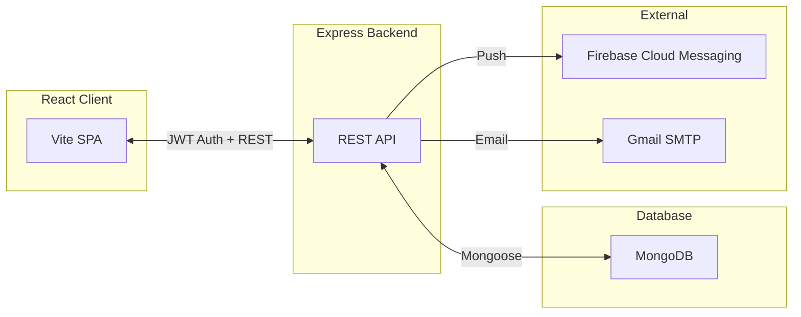
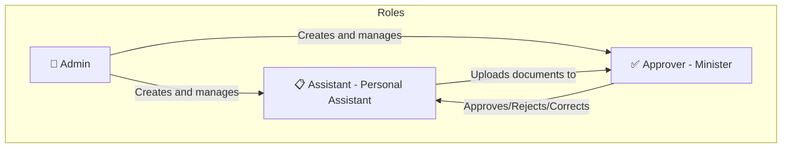
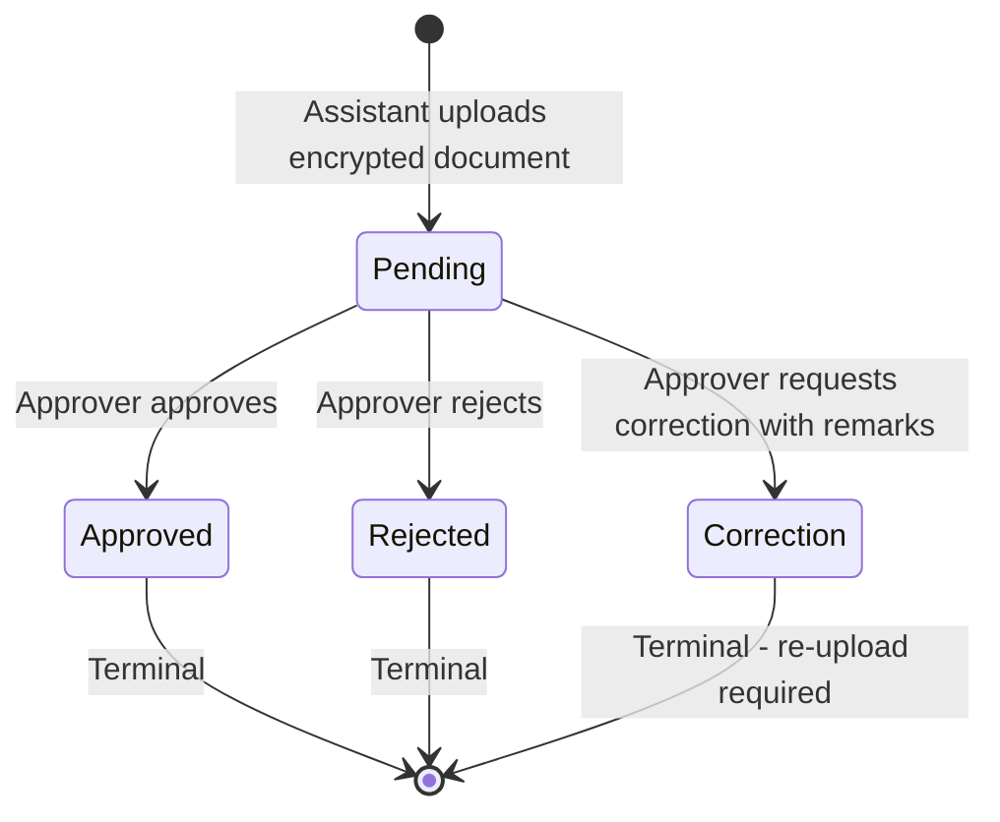
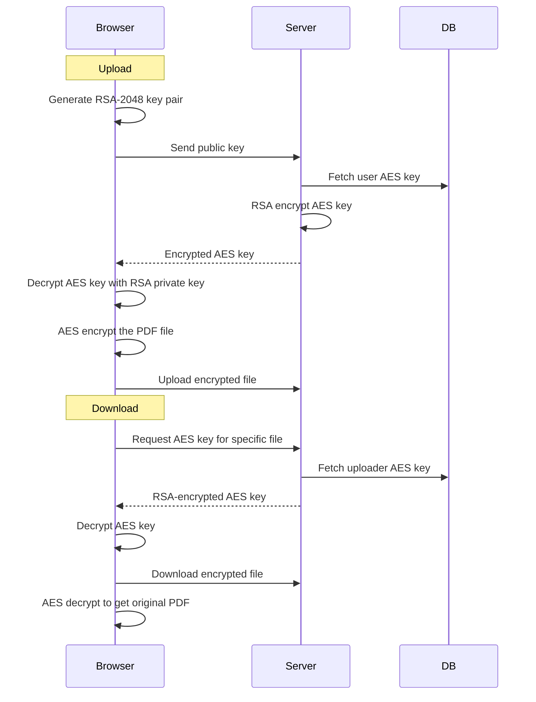

# 📄 Document Approval System

A full-stack web application that **digitises the document approval workflow** between Personal Assistants and Ministers. Instead of physically carrying files for signatures, assistants upload encrypted documents that approvers can review, approve, reject, or request corrections on — all through a secure web interface with real-time push notifications.

---

## ✨ Key Features

- **Role-Based Access Control** — Three distinct roles (Admin, Assistant, Approver) with fine-grained permissions
- **End-to-End Document Encryption** — Files are AES-encrypted client-side before upload; keys exchanged via RSA-2048 OAEP
- **Document Workflow Engine** — Status tracking (Pending → Approved / Rejected / Correction) with audit timestamps
- **Real-Time Push Notifications** — Firebase Cloud Messaging delivers instant updates on document status changes
- **Multi-Device Session Support** — Users can be logged in on multiple devices simultaneously
- **Admin Dashboard** — User registration, profile management, account activation/deactivation
- **Department Categorisation** — Organise documents by government departments
- **Document History & Filtering** — Search and filter documents by status, department, date range

---

## 🏗️ Architecture Overview



> 📖 For a comprehensive deep-dive into the architecture, see [ARCHITECTURE.md](./ARCHITECTURE.md)

---

## 🛠️ Tech Stack

### Backend

| Technology             | Purpose                                |
| :--------------------- | :------------------------------------- |
| Node.js + Express v4   | REST API server                        |
| MongoDB + Mongoose v8  | Database and ODM                       |
| JWT + Argon2id         | Authentication and password hashing    |
| Multer                 | File upload handling                   |
| node-forge + crypto    | RSA/AES encryption key management      |
| Firebase Admin SDK     | Push notifications via FCM             |
| Nodemailer             | Email delivery (credentials, OTP)      |
| Joi                    | Request validation                     |

### Client

| Technology             | Purpose                                |
| :--------------------- | :------------------------------------- |
| React 19               | UI framework                           |
| Vite 8                 | Build tool and dev server              |
| TailwindCSS 4          | Styling                                |
| React Router DOM v7    | Client-side routing                    |
| Axios                  | HTTP client with interceptors          |
| CryptoJS + node-forge  | Client-side AES encryption & RSA keys  |
| Firebase Web SDK       | FCM token generation & messaging       |
| react-hot-toast        | Toast notification UI                  |

---

## 📂 Project Structure

```
document-approval-system/
├── backend/                      # Express.js REST API
│   ├── server.js                 # App entry point
│   ├── config/                   # App and Multer configuration
│   ├── controllers/              # Route handlers (auth, file, user, dept, notification)
│   ├── middlewares/              # Auth, validation, and file middlewares
│   ├── models/                   # Mongoose schemas (User, File, Session, etc.)
│   ├── routes/                   # Express route definitions
│   ├── utils/                    # Helpers (error handling, email, encryption, FCM)
│   ├── uploads/                  # Encrypted file storage
│   └── Dockerfile
├── client/                       # React + Vite SPA
│   ├── src/
│   │   ├── App.jsx               # Root component with providers and routing
│   │   ├── components/           # Reusable UI components (Navbar, Layout, etc.)
│   │   ├── pages/                # Page components (dashboards, login, history, etc.)
│   │   ├── contexts/             # React Context providers (Auth, Encryption, Notification)
│   │   ├── guards/               # Route protection components
│   │   ├── hooks/                # Custom hooks (useFileHandlers)
│   │   └── services/             # API service layer (Axios-based)
│   ├── utils/                    # Shared utilities (crypto, firebase, enums)
│   └── Dockerfile
├── docker-compose.yml            # Multi-container orchestration
└── README.md
```

---

## 👥 User Roles



| Role          | Description                                                            |
| :------------ | :--------------------------------------------------------------------- |
| **Admin**     | System administrator — registers users, manages profiles and status, manages departments |
| **Assistant** | Personal Assistant — uploads documents for approval, tracks their status, receives decision notifications |
| **Approver**  | Minister — reviews uploaded documents, approves/rejects/requests corrections, limited to one approver in the system |

---

## 📑 Document Workflow



Each status transition:
- Records a timestamp (`approvedDate`, `rejectedDate`, `correctionDate`)
- Creates an in-app notification for the relevant user
- Sends a push notification via Firebase Cloud Messaging

---

## 🔐 Security Features

- **AES-256 client-side encryption** — Documents are encrypted before leaving the browser
- **RSA-2048 OAEP key exchange** — Encryption keys are securely transferred using asymmetric cryptography
- **Argon2id password hashing** — Memory-hard algorithm (64MB, 3 iterations, parallelism 4)
- **JWT + server-side sessions** — Tokens are revocable via session deletion in MongoDB
- **Joi input validation** — All endpoints validate inputs with strict schemas
- **Role-based middleware** — Server-side authorization on every protected route
- **Ownership-scoped file access** — Assistants can only access their own documents
- **CORS whitelist** — Only specified origins allowed
- **HttpOnly cookies** — Session cookies protected from XSS

---

## 🚀 Getting Started

### Prerequisites

- **Node.js** v18 or later
- **MongoDB** (local or Atlas)
- **Firebase project** with Cloud Messaging enabled
- **Gmail account** with App Passwords enabled (for email notifications)

### 1. Clone the Repository

```bash
git clone https://github.com/ShreyashG19/document-approval-system.git
cd document-approval-system
```

### 2. Backend Setup

```bash
cd backend
npm install
```

Create a `.env` file (see `.env.sample` for reference):

```env
PORT=4000
MONGODB_URI=mongodb+srv://your-connection-string
JWT_SECRET=your-jwt-secret
AUTH_EMAIL=your-email@gmail.com
AUTH_PASS=your-gmail-app-password
BASE_UPLOAD_DIR=/absolute/path/to/uploads
SESSION_SECRET=your-session-secret
```

Set up Firebase Admin:
- Place your `firebase-service-account.json` in `backend/utils/firebase/`

Start the server:

```bash
npm run dev
```

### 3. Client Setup

```bash
cd client
npm install
```

Create a `.env` file:

```env
VITE_API_URL=http://localhost:4000/api
VITE_FIREBASE_API_KEY=your-firebase-api-key
VITE_FIREBASE_AUTH_DOMAIN=your-project.firebaseapp.com
VITE_FIREBASE_PROJECT_ID=your-project-id
VITE_FIREBASE_STORAGE_BUCKET=your-project.appspot.com
VITE_FIREBASE_MESSAGING_SENDER_ID=your-sender-id
VITE_FIREBASE_APP_ID=your-app-id
VITE_FIREBASE_MEASUREMENT_ID=your-measurement-id
VITE_FIREBASE_VAPID_KEY=your-vapid-key
```

Start the dev server:

```bash
npm run dev
```

### 4. Docker (Alternative)

```bash
# From the project root
docker-compose up --build
```

This starts:
- Backend on `http://localhost:4000`
- Client on `http://localhost:5173`

---

## 📡 API Overview

| Domain           | Base Path             | Key Endpoints                                      |
| :--------------- | :-------------------- | :------------------------------------------------- |
| **Auth**         | `/api/auth`           | `POST /login`, `POST /register`, `POST /logout`, `GET /get-session` |
| **Files**        | `/api/file`           | `POST /upload-pdf`, `GET /download-pdf/:name`, `GET /get-documents`, `POST /approve`, `POST /reject`, `POST /correction` |
| **Users**        | `/api/user`           | `GET /get-users`, `POST /update-profile`, `POST /set-user-status`, `POST /send-credentials` |
| **Departments**  | `/api/department`     | `GET /get-all-departments`, `POST /add-department` |
| **Notifications**| `/api/notification`   | `GET /get-notifications`, `POST /mark-seen`        |

> 📖 For full API documentation, see `backend/swagger.yaml` or `backend/API_DOC.md`

---

## 🔒 Encryption Flow



---

## 🔔 Notification System

The notification system operates on two channels:

1. **In-App Notifications** — Stored in MongoDB, fetched on demand, marked as seen
2. **Push Notifications** — Delivered via Firebase Cloud Messaging to all active devices

**Triggers:**
- Document uploaded → Notify Approver
- Document approved → Notify Assistant
- Document rejected → Notify Assistant
- Correction requested → Notify Assistant

---

## 📝 License

ISC

---

## 🤝 Contributing

1. Fork the repository
2. Create a feature branch (`git checkout -b feature/my-feature`)
3. Commit your changes (`git commit -m 'Add my feature'`)
4. Push to the branch (`git push origin feature/my-feature`)
5. Open a Pull Request
